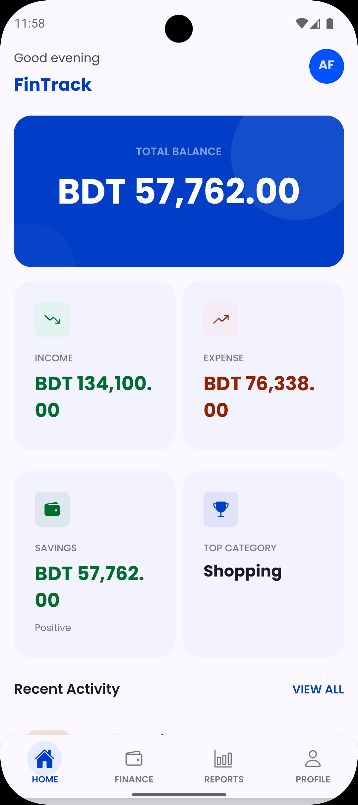
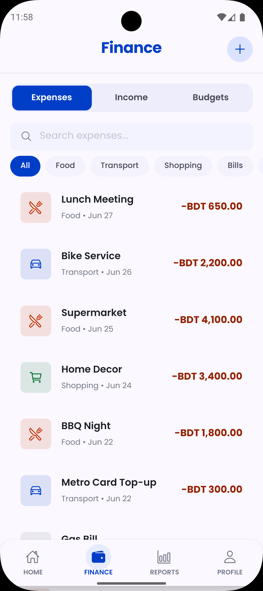
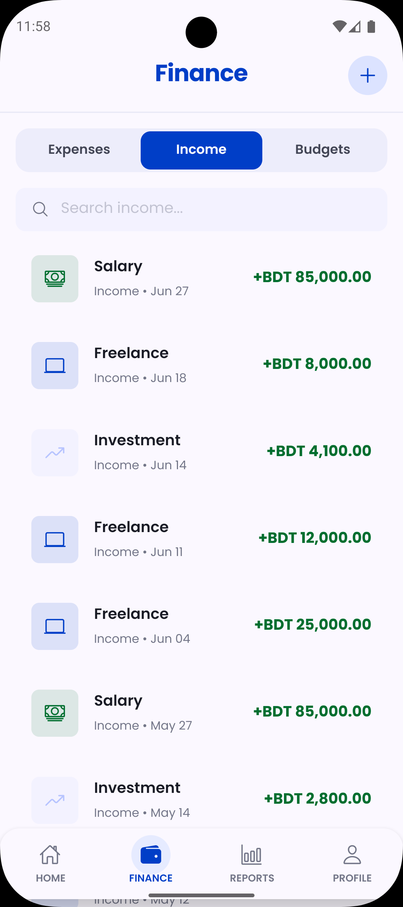
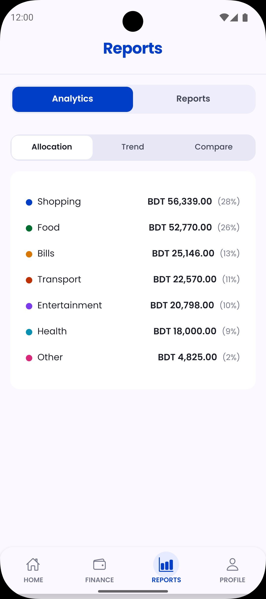
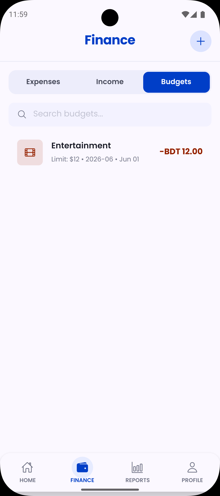
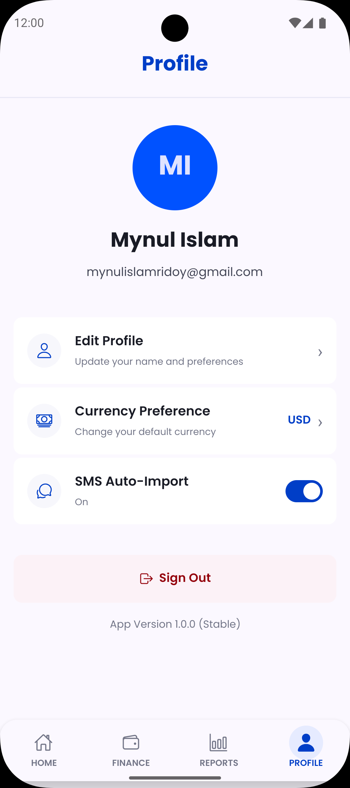
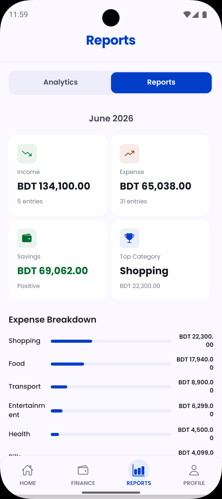

# FinTrack — Personal Finance Management App

[](https://github.com/mynulislam2/Finance-Management/actions/workflows/ci-cd.yml)
[](https://github.com/mynulislam2/Finance-Management)
[](https://github.com/mynulislam2/Finance-Management/actions/workflows/ci-cd.yml)

A cross-platform mobile application built with **React Native CLI (TypeScript)** that helps users track expenses, manage income, handle recurring payments, set budgets, and gain financial insights through interactive charts and reports.

## Screenshots

|             🏠 Dashboard              |               💳 Expenses                |               💵 Income               |                     📊 Analytics                      |
| :-----------------------------------: | :--------------------------------------: | :-----------------------------------: | :---------------------------------------------------: |
|  |  |  |  |

|              📋 Budgets               |                     🧾 Transactions                     |               👤 Profile               |               📈 Reports               |
| :-----------------------------------: | :-----------------------------------------------------: | :------------------------------------: | :------------------------------------: |
|  |  |  |  |


## Tech Stack

- **Frontend**: React Native CLI + TypeScript, React Navigation v7, Redux Toolkit, Victory Native (charts)
- **Backend**: Supabase (PostgreSQL + Row Level Security), Supabase Auth
- **Networking**: Axios (HttpService singleton with interceptors)
- **Key Libraries**: date-fns, React Native Vector Icons
  
## Features

- **Auth** — Email/password sign-up, login, password reset with persisted sessions
- **Dashboard** — Balance overview, income vs expense cards, budget progress, recent transactions
- **Expense Management** — Full CRUD with categories, payment methods, notes
- **Income Tracking** — Multiple income sources with date-based tracking
- **Recurring Payments** — Daily/weekly/monthly/yearly frequencies with auto next-date calculation
- **Budget Management** — Per-category monthly limits with real-time spending progress
- **Analytics** — Category pie chart, monthly trend bar chart, income vs expense comparison
- **Reports** — Monthly/yearly summaries with savings and top category insights
- **SMS Auto-Import** — Automatically detects bank SMS (debit/credit/UPI) and creates expense/income entries with hash-based deduplication
- **Profile** — Editable user profile with currency preference, SMS import toggle

## Architecture

The app follows a layered architecture:

```
Screen → Hook → Service → HttpService → Supabase REST API
```

- **`constants/`** — `colors.ts` (design tokens), `strings.ts` (all UI text), `index.ts` (categories, frequencies)
- **`services/urls.ts`** — Centralized API endpoint definitions
- **`services/http/HttpService.ts`** — Singleton axios wrapper with auth interceptors, error handling, and token injection
- **`services/auth/`**, **`services/db/`**, **`services/profile/`** — Business logic services that use HttpService internally
- **Redux Toolkit** manages client-side state across all modules

## Project Structure

```
src/
├── assets/           # Images, icons, fonts
├── components/       # Reusable UI (common, charts, transactions)
├── constants/        # colors.ts, strings.ts, categories
├── screens/          # Auth, Dashboard, Expenses, Income, Recurring,
│                     # Budget, Analytics, Reports, Profile
├── navigation/       # Root, Auth, and Bottom Tab navigators
├── services/
│   ├── http/         # HttpService (axios singleton with interceptors)
│   ├── auth/         # Authentication service
│   ├── db/           # Expense, Income, Budget, Recurring services
│   └── profile/      # Profile service
│   └── urls.ts       # All API endpoint constants
├── hooks/            # useAuth, useExpenses, useBudgets
├── store/            # Redux slices (auth, expense, budget)
├── types/            # TypeScript interfaces
└── lib/              # Supabase client initialization
```


## Getting Started

### Prerequisites

- Node.js >= 20
- Android Studio (for Android) or Xcode (for iOS)
- Supabase project

### Setup

```bash
npm install
```

Add your Supabase credentials to `.env.local`:

```
SUPABASE_URL=https://<project>.supabase.co
SUPABASE_ANON_KEY=<your-anon-key>
```

### Run on Android

```bash
npx react-native run-android
```

### Run on iOS

```bash
cd ios && pod install && cd ..
npx react-native run-ios
```

## CI/CD

On every push to `main`, the pipeline runs **typecheck**, **lint**, **tests**, and builds a **release APK** — available as a downloadable artifact from the Actions tab.
